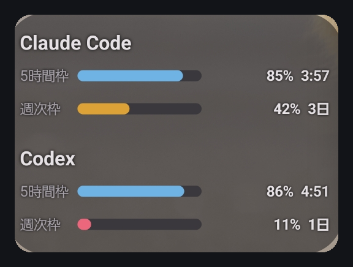
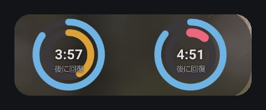
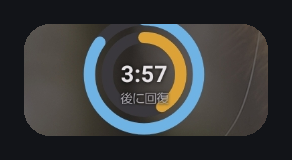
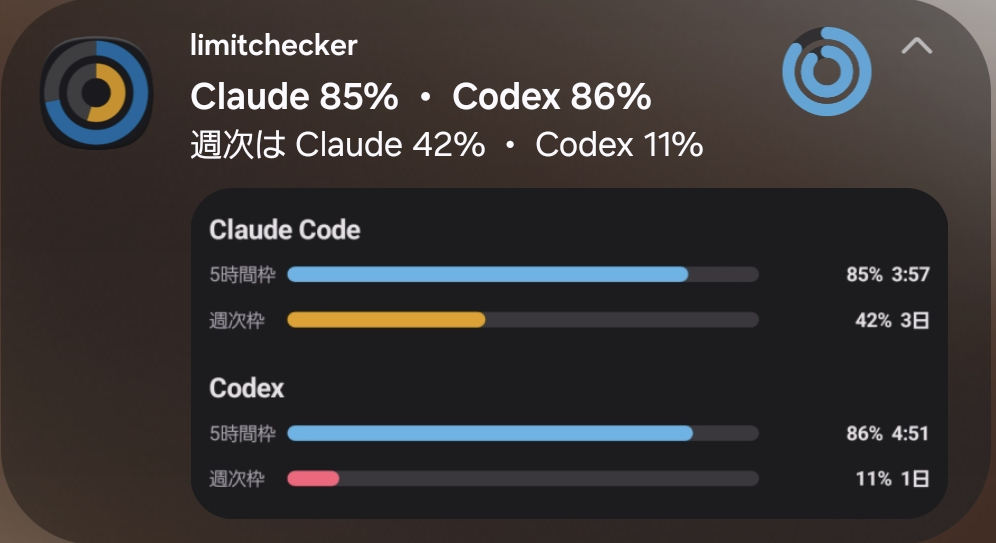

# limitchecker

[English](README.en.md) | 日本語

Claude Code と Codex の残量を、Android のホーム画面と通知領域で把握するためのツール。

長い作業に入る前に残量が分からず途中で止まる、という困りごとを解決する。

## 特徴: 認証情報を持たない

**このアプリは Claude や OpenAI のアカウントにログインしない。** API キーも要求しない。

- Claude Code — statusLine に渡ってくる値をそのまま使う
- Codex — App Server の `account/rateLimits/read` を呼ぶ。認証は App Server が扱う

どちらも `~/.claude/.credentials.json` や `~/.codex/auth.json` を読まない。
**Android アプリが持つ秘密は、自分で立てた hub のトークン1つだけ**で、
それも Android Keystore の鍵で暗号化して保存する。

代償として、**Claude Code の残量は Claude Code が動いているときにしか更新されない**。
値が古くなったら、正確なふりをせずグレーにして「未更新」と表示する。

## 仕組み

```
作業マシン（Mac / Linux）              1台だけ           Android
┌──────────────────┐          ┌─────────┐      ┌──────────┐
│ Claude Code          │          │          │      │ ウィジェット │
│   └ statusLine ──→ agent │ ──POST──→│   hub    │──GET─→│ 常設通知    │
│ Codex app-server ──→ agent │          │          │      │ ステータスバー│
└──────────────────┘          └─────────┘      └──────────┘
```

| 要素 | 役割 | 常駐 |
| --- | --- | --- |
| agent | 残量だけを抜き出して hub へ送る | 不要 |
| hub | 全マシンの状態を集約し、アカウント単位に畳んで返す | 1台のみ |
| Android | ウィジェット・通知・ステータスバーで表示する | — |

残量の枠はアカウントに紐づくため、マシンが増えてもリングは1組のまま。

## 表示

<table>
  <tr>
    <td width="55%" valign="top">
      
      <br><sub><b>横棒</b>（幅220dp・高さ170dp 以上）</sub>
    </td>
    <td width="45%" valign="top">
      
      <br><sub><b>ドーナツ2つ</b>（幅190dp 以上）</sub>
      <br><br>
      
      <br><sub><b>ドーナツ1つ</b>（1×1 など）</sub>
    </td>
  </tr>
</table>



<sub><b>通知センターに常設</b>。見出しが5時間枠、本文が週次枠</sub>

大きさに応じて表現が変わる。

| 大きさ | 表現 |
| --- | --- |
| 幅220dp・高さ170dp 以上 | **横棒**。枠の種類・残量・回復までの時間を並べる |
| 幅190dp 以上 | 二重ドーナツを横に2つ |
| 縦長 | 二重ドーナツを縦に2つ |
| 1×1 など | 二重ドーナツを1つ |

- **残量は弧や棒の長さ**で表す。色が読めなくても情報が失われない
- **配色3種**（青とオレンジ / 濃淡のみ / 信号）。既定は色覚特性があっても判別できる
- **背景3種**（不透明 / 半透明 / 透過）
- **通知センターに常設**でき、ステータスバーにも出せる
- ステータスバーに出すものは**4種**から選べる。サービスは Claude / Codex / 両方

## セットアップ

依存は Python 3 のみ。hub と agent に追加インストールは要らない。

### 1. hub を常駐させる（どこか1台）

常時起動している Linux 機を勧める。Mac でも手順は同じ。

```sh
git clone https://github.com/mirute02/limitchecker.git
cd limitchecker
./deploy/install-hub.sh
```

systemd（Linux）と launchd（macOS）の違いはスクリプトが吸収する。
起動時に自動で立ち上がり、落ちたら再起動する。

```sh
./deploy/install-hub.sh --status      # 状態を見る
./deploy/install-hub.sh --uninstall   # 登録を外す
```

外出先から見るなら `.env` を次のようにして、もう一度実行する。

```
LIMITCHECKER_BIND=tailscale
```

`tailscale` と書けば、この機械の Tailscale アドレスを自動で引く。
`0.0.0.0` は安全のため起動を拒否する。

### Tailscale で使うときの注意

**hub が待ち受けるアドレスと、アプリに入れる URL は別物。**

| | 入れるもの |
| --- | --- |
| `.env` の `LIMITCHECKER_BIND` | `tailscale`（または IP）。「自分のどの口で待つか」なので実在するアドレスが要る |
| **アプリの hub の URL** | **MagicDNS 名**。`http://gpu.tailnet-name.ts.net:8787` |

アプリは平文 HTTP を `localhost` と `*.ts.net` に限っている
（`network_security_config`）。**Android の照合に IP アドレスは一致しない**ため、
`http://100.x.y.z:8787` を入れると通信する前に拒否される。
短縮名（`gpu` だけ）も `.ts.net` で終わらないので通らない。

**調べなくてよい。** `./deploy/install-hub.sh` が最後に、
アプリへ入れる URL をそのまま表示する。

```
────────────────────────────────────────
 Android アプリに入れる値
────────────────────────────────────────
  hub の URL : http://gpu.tailnet-name.ts.net:8787
  接続コード : 次を実行すると6桁のコードが出ます
               python3 /path/to/limitchecker/hub/pair.py
────────────────────────────────────────
```

### 2. agent を仕込む（Claude Code / Codex を使うマシンごと）

```sh
./deploy/install-agent.sh
```

`settings.json` に statusLine を足し、Codex があれば定期実行も登録する。
**既存の設定は壊さない。** 別の statusLine が既にある場合は上書きせず中止する。

```sh
./deploy/install-agent.sh --status      # 状態を見る
./deploy/install-agent.sh --uninstall   # 外す
```

Codex の通信に回避策が要る環境（Termux など）では、ラッパーを `.env` で指定する。
`alias` はスクリプト内で展開されないため、指定しないと回避策を通らない。

```
LIMITCHECKER_CODEX_BIN=/path/to/codex-wrapper
```

### 3. Android アプリ

[リリース](https://github.com/mirute02/limitchecker/releases)から APK を入れるか、自分でビルドする。

```sh
cd android
echo "sdk.dir=/path/to/android-sdk" > local.properties
gradle assembleDebug
```

必要なもの: JDK 17 以上、Android SDK（compileSdk 37）、Gradle 9 系。

### 4. 接続する

hub を置いたマシンで接続コードを発行する。

```sh
python3 hub/pair.py
```

6桁のコードが出るので、アプリの「接続コードで設定」に hub の URL と一緒に入れる。
43文字のトークンを手で転記しなくてよい。

コードは**5分間有効、1回限り、5回間違えると打ち切り**。

### 5. 届いているか確かめる

作業マシンで実行する。送信先・認証・受理の可否をその場で試す。

```sh
./deploy/install-agent.sh --status
```

```
  Claude Code: 設定済み
  Codex: 登録済み

-- hub への送信 --
  送信先: http://100.x.y.z:8787
  OK: 送信が届き、内容も受理されました。
```

**この確認は残量の値を書き換えない。** 届かない場合は理由が出る。

## 権限

| 権限 | 用途 | 実行時確認 |
| --- | --- | --- |
| `INTERNET` | hub への通信 | なし |
| `ACCESS_NETWORK_STATE` | 圏外判定（省電力） | なし |
| `POST_NOTIFICATIONS` | 常設通知（任意機能） | あり |

`WAKE_LOCK` / `RECEIVE_BOOT_COMPLETED` / `FOREGROUND_SERVICE` は WorkManager が
自動で追加する。実行時確認が出るのは `POST_NOTIFICATIONS` だけ。

位置情報、ストレージ、連絡先、`QUERY_ALL_PACKAGES`、アクセシビリティ、
電池最適化の除外は**要求しない**。

## 電池

| 状態 | バックグラウンドの通信 |
| --- | --- |
| ウィジェットも通知もなし | ゼロ |
| ウィジェットか通知あり | 15分ごと。**画面 OFF 中は停止** |

残量は分単位で変化しないため、短い間隔にしても情報は増えず通信回数だけ増える。

## セキュリティ

秘密情報と個人情報の扱いは [docs/security.md](docs/security.md) に定めている。
監査の記録は [docs/audit-2026-09-20.md](docs/audit-2026-09-20.md)。

開発に参加する場合は、秘密検出フックを有効にする。

```sh
git config core.hooksPath .githooks
```

## うまくいかないとき

実際に起きた順に並べてある。**上から確認すると早い。**

### 「接続できましたが、まだ残量が届いていません」

hub には繋がっているが、agent が送っていない状態。

```sh
./deploy/install-agent.sh --status
```

送信先・認証・受理の可否をその場で試す。**この確認は残量の値を書き換えない。**

「OK: 送信が届き…」と出たら、あとは Claude Code を**一度動かす**だけ。
statusLine は Claude Code の操作のたびに呼ばれるが、hub への送信は60秒に
間引いているため、すぐに出ないことがある。

### hub の設定を変えたのに反映されない

hub は `.env` を**起動時にしか読まない**。変えたら再登録する。

```sh
./deploy/install-hub.sh
```

`--status` で、`.env` に書いた値と**実際に開いているポート**の両方が出る。
食い違っていれば再起動されていない。

### 「hub に接続できません」

まず hub 側を見る。

```sh
./deploy/install-hub.sh --status
```

待ち受けが `127.0.0.1` なら、**他の端末からは繋がらない**。
`.env` を `LIMITCHECKER_BIND=tailscale` にして再登録する。

待ち受けが Tailscale のアドレスなら、**アプリに入れた URL** を確認する。
IP ではなく MagicDNS 名でないと通らない。正しい URL は `--status` が表示する。

### 「トークンが違います」

hub 側の `.env` の `LIMITCHECKER_TOKEN` と、アプリに入れた値が違う。
**接続コードを使えば転記ミスが起きない。**

```sh
python3 hub/pair.py
```

### Codex のリングが出ない

その hub が Codex の報告を一度も受けていない。設定していないサービスは、
故障に見えないよう**表示しない**ようにしている。

```sh
./deploy/install-agent.sh --codex
python3 agent/codex.py        # すぐ試すなら
```

Codex は Claude Code と違って呼んでくれる相手がいないため、定期実行が要る。

### 値が薄い・グレーになっている

**仕様。** Claude Code の残量は Claude Code が動いているときにしか更新されない。
10分を超えると薄く、1時間を超えるとグレーになって「未更新」と出る。
古い値を新しいふりをして見せないための表示。

Codex は定期実行なのでこの制約を受けない。

### ウィジェットに何も出ない・置けない

ウィジェットは設定前でも置ける。「タップして hub を設定」と出ていれば、
タップすると設定画面が開く。


## 制約

- **Claude Code の残量は実行中にしか更新されない。** 10分を超えると薄く、
  1時間を超えるとグレーになる。Codex は定期実行なのでこの制約を受けない
- **モデル別の週次枠は取得できない。** statusLine が返すのは5時間枠と週次枠のみ
  （[確認結果](docs/findings-statusline.md)）
- **入力待ちの通知は作っていない。** Claude Code の Remote Control に
  同等の機能があるため（`/config` の「Push when actions required」）

## ドキュメント

| | |
| --- | --- |
| [docs/design.md](docs/design.md) | 当初の設計書 |
| [docs/decisions.md](docs/decisions.md) | 設計書からの変更点と、その理由 |
| [docs/findings-statusline.md](docs/findings-statusline.md) | statusLine が返す値の実測 |
| [docs/security.md](docs/security.md) | セキュリティ方針 |
| [docs/audit-2026-09-20.md](docs/audit-2026-09-20.md) | 監査の記録 |

## 実装状況

| 内容 | 状態 |
| --- | --- |
| agent と hub | 完了 |
| ウィジェット | 完了 |
| 常設通知・ステータスバー | 完了 |
| Codex 対応 | 完了 |
| 接続コード | 完了 |
| 接続の確認手段 | 完了 |
| 消費速度と枯渇予測 | 未着手 |
| イベント検知 | 作らない（Remote Control で代替） |

## ライセンス

MIT License. 詳細は [LICENSE](LICENSE) を参照。
