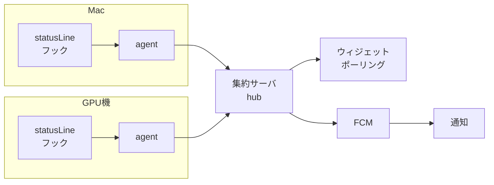
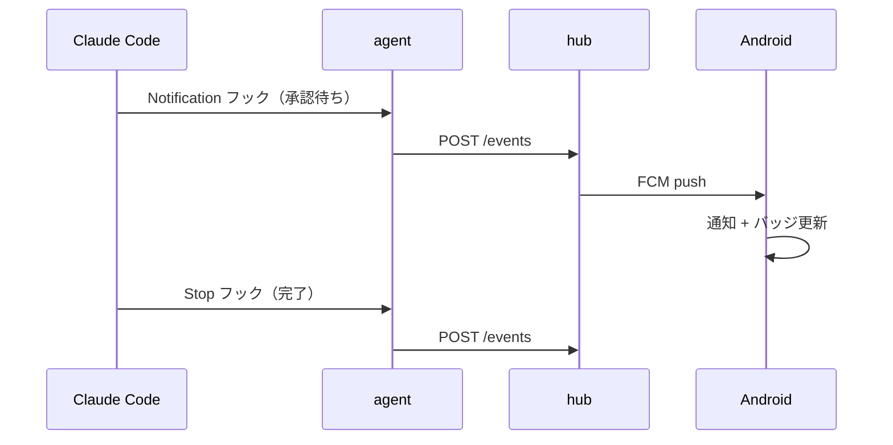

# 残スタミナウィジェット 設計書

2026-09-19

## 目的と全体像

Claude Code と Codex の残量をホーム画面で一目で把握し、エージェントが操作を待っている状態を見逃さないようにする。

解決したい困りごとは2つ。長い作業に入る前に残量が分からず途中で止まる。もう1つは、別マシンで走らせたエージェントが承認待ちや完了で止まっているのに気づかない。

### 2つの層を分けて扱う

使用量の枠はアカウントに紐づき、マシンには紐づかない。Mac と Linux GPU 機で同じアカウントを使っていれば、5時間枠も週次枠も共有される。一方で「入力待ち」「タスク完了」はセッション単位なので、どのマシンで起きたかが重要になる。

| 層 | 単位 | 表示 |
| --- | --- | --- |
| 残量 | アカウント（Claude / Codex の2組） | 三重ドーナツ 2つ |
| イベント | マシン × セッション | マシン別バッジ + 通知 |

この分離が設計の軸になる。残量のリングはマシンが何台あっても2組のまま増えない。

### スコープ外

- コストの円グラフ化や請求額の追跡（残量の把握が目的で、金額は見ない）
- ウィジェットからのエージェント操作（見るだけ。操作は端末で行う）
- Claude や Codex 以外のサービス

## データソース

残量もイベントも、各マシンのローカルから取る。外部 API キーは使わない。

| 取りたい値 | 取得元 | 備考 |
| --- | --- | --- |
| Claude Code の5時間枠・週次枠 | `settings.json` の `statusLine` に渡る JSON の `rate_limits` | 実測値。最も確実 |
| Claude Code のモデル別週次枠 | 同上 | 内側リング用。フィールド名は実機確認が必要 |
| Claude Code の消費履歴 | `~/.claude/projects/**/*.jsonl` | ccusage と同じ経路。補助的 |
| Codex の5時間枠・週次枠 | Codex CLI が内部で叩く `GET /api/codex/usage` | TUI の `/status` と同じ値 |
| 入力待ち | Claude Code の Notification フック | 承認要求や質問で発火 |
| タスク完了 | Claude Code の Stop フック | 応答終了時に発火 |

### statusLine を使う理由

JSONL のログから推定するより、`rate_limits` の実測値のほうが正確で軽い。statusLine はコマンドを実行するたびに呼ばれるため、エージェント側は受け取った JSON をファイルに書き出すだけでよい。

注意点として、statusLine は Claude Code が動いているときしか更新されない。しばらく使っていなければ値が古くなるので、取得時刻を必ず持たせて、ウィジェット側で鮮度を表示する。

### Codex 側

`/api/codex/usage` は CLI 内部の経路であり公開 API ではない。仕様が変わる可能性を前提にし、取得失敗時はリングをグレーにして「取得不可」と出す設計にする。

### 参考

- [Claude Code コスト管理（公式）](https://code.claude.com/docs/ja/costs.md)
- [Codex のレート制限取得に関する issue](https://github.com/openai/codex-plugin-cc/issues/102)

## システム構成

各マシンに軽量なエージェントを置き、1台を集約サーバにする。Android は集約サーバだけを見る。



### 役割分担

| 要素 | 役割 |
| --- | --- |
| agent | statusLine とフックから受け取った値をローカルに保持し、hub へ POST する。常駐プロセスは持たず、呼ばれたときだけ動く |
| hub | 全マシンの状態を集約し、残量はアカウント単位に畳んで返す。イベント発生時に FCM へ押す。1台に置く（GPU機が妥当） |
| ウィジェット | hub をポーリングして描画。タップで即時更新 |

### なぜ hub を挟むか

マシンが増えてもウィジェット側の設定が変わらない。残量をアカウント単位に畳む処理を1か所にまとめられる。FCM のトークン管理も集約できる。

マシンが1台に固定なら hub と agent を同居させてよい。

### ネットワーク

外出先から見るため Tailscale を経由する。hub は Tailscale のアドレスでのみ待ち受け、認証は固定トークンをヘッダに載せる程度で足りる。既存の GPU 機モニタリング用の仕組みがあれば、そこにエンドポイントを追加する形でもよい。

## ウィジェット表示仕様

三重ドーナツを2つ横に並べる。左が Claude Code、右が Codex。

### リングの割り当て

| 位置 | 内容 | Claude Code | Codex |
| --- | --- | --- | --- |
| 外側 | 5時間枠の残量 | `rate_limits` の5時間枠 | 5h limit |
| 中央 | 週次枠の残量 | 週次枠 | Weekly limit |
| 内側 | モデル別の週次枠 | Opus 等の週次枠 | Code review weekly |

残量を表示する。使用率ではなく「あとどれだけ使えるか」で統一し、リングは減っていく向きに描く。

### 配色と状態

| 残量 | 色 |
| --- | --- |
| 50%超 | 緑 |
| 20〜50% | 黄 |
| 20%未満 | 赤 |
| 取得失敗・データ古い | グレー |

中心にはサービス名と、最も逼迫しているリングの残%を数字で置く。リセットまでの残り時間はリングの下に小さく添える。

### マシン別バッジ

リングの外周、または各ドーナツの下に、マシンごとの小さなチップを並べる。チップには短いマシン名と状態を表す点を置く。

| 状態 | 表示 |
| --- | --- |
| 入力待ち | 赤い点 + 件数 |
| 完了（未確認） | 青い点 + 件数 |
| 稼働中 | 点灯 |
| アイドル | 消灯 |

入力待ちが1件でもあれば、ウィジェット全体の縁を赤くして遠目でも分かるようにする。

### サイズ別レイアウト

| サイズ | 内容 |
| --- | --- |
| 4×2 | ドーナツ2つ + マシンチップ。標準 |
| 2×2 | ドーナツ1つのみ（どちらを出すか設定） |
| 4×4 | ドーナツ2つ + マシンごとの行（名前・状態・最終更新） |

### 鮮度の表示

statusLine は Claude Code の実行時しか更新されないため、取得時刻からの経過を必ず出す。10分以上古ければ数字を薄くし、1時間以上ならグレーにする。

### タップ動作

- ドーナツ部分 → 即時更新
- マシンチップ → アプリを開き、そのマシンのイベント一覧を表示

## イベント検知と通知

拾うイベントは2種類に絞る。入力待ちとタスク完了。

### 検知方法

Claude Code のフック機構を使う。ポーリングやログ監視より確実で軽い。



| イベント | フック | 送る内容 |
| --- | --- | --- |
| 入力待ち | Notification | マシン名、セッションID、要求の種類、作業ディレクトリ |
| タスク完了 | Stop | マシン名、セッションID、作業ディレクトリ |

Codex 側も同等の通知設定があれば同じ経路に載せる。なければ MVP では Claude Code のみ対応とする。

### 通知の設計

| イベント | 通知 | チャンネル |
| --- | --- | --- |
| 入力待ち | 音あり、優先度高 | 待たせている状態なので即座に気づきたい |
| タスク完了 | 無音、優先度標準 | まとめて確認できればよい |

入力待ちの通知は、応答があるまで残す。同じセッションで複数回発火した場合は通知を置き換え、積み上げない。

完了通知は、5分以内に複数件あればまとめて1件にする。

### 未確認状態の管理

イベントには未確認フラグを持たせ、バッジの件数はこれを数える。既読にするタイミングは3つ。

1. アプリでイベント一覧を開いた
2. 通知をタップまたはスワイプで消した
3. そのセッションで次のイベントが発生した（入力待ち → 完了など）

### 上限到達時の扱い

今回のバッジ対象には含めないが、残量が20%を切ったときにウィジェットの色が変わることで気づける。通知は出さない。

## API 仕様

ウィジェットが叩くのは `GET /status` 1本のみ。1回の応答で描画に必要なすべてが揃う。

### GET /status

```json
{
  "fetched_at": "2026-09-19T14:32:10+09:00",
  "services": [
    {
      "id": "claude_code",
      "label": "Claude Code",
      "available": true,
      "updated_at": "2026-09-19T14:30:02+09:00",
      "rings": [
        { "slot": "outer", "label": "5h", "remaining": 0.62, "resets_at": "2026-09-19T17:00:00+09:00" },
        { "slot": "middle", "label": "week", "remaining": 0.41, "resets_at": "2026-09-22T09:00:00+09:00" },
        { "slot": "inner", "label": "Opus week", "remaining": 0.18, "resets_at": "2026-09-22T09:00:00+09:00" }
      ]
    },
    { "id": "codex", "label": "Codex", "available": false, "error": "usage_unavailable" }
  ],
  "machines": [
    {
      "id": "mac",
      "label": "Mac",
      "state": "waiting_input",
      "unread": { "waiting_input": 1, "completed": 0 },
      "last_seen": "2026-09-19T14:31:55+09:00"
    },
    {
      "id": "gpu",
      "label": "GPU",
      "state": "running",
      "unread": { "waiting_input": 0, "completed": 2 },
      "last_seen": "2026-09-19T14:32:01+09:00"
    }
  ]
}
```

`remaining` は 0.0〜1.0 の残り割合。取得できないサービスは `available: false` にして、ウィジェットはグレー表示にする。`state` は `idle` / `running` / `waiting_input` / `error` の4値。

### その他のエンドポイント

| メソッド | パス | 用途 |
| --- | --- | --- |
| POST | `/ingest` | agent が残量とハートビートを送る |
| POST | `/events` | agent がフック発火を送る |
| GET | `/events?machine=mac` | アプリでイベント一覧を表示する |
| POST | `/events/ack` | 既読にする |
| POST | `/register` | FCM トークンを登録する |

### 認証

固定トークンを `Authorization` ヘッダに載せる。Tailscale 内でのみ待ち受けるため、これ以上は要らない。トークンは Android 側で設定画面から入力し、`DataStore` に保存する。

## 未確定事項

実装前に手元で確認すること。いずれも数分で済む。

### 1. statusLine の JSON にモデル別週次枠が含まれるか

内側リングの前提になる。確認手順は、`settings.json` の `statusLine` に受け取った JSON をそのままファイルへ書き出すスクリプトを設定し、Claude Code を1回動かして中身を見る。

含まれない場合の代替案:

- `/usage` の出力をパースする
- 内側リングを「今日の消費量」に差し替える
- 2周に減らす

### 2. Codex の usage 取得経路が手元で動くか

`GET /api/codex/usage` を CLI の認証情報で叩けるか確認する。動かなければ Codex 側は MVP から外し、Claude Code の1ドーナツで始める。

### 3. Codex に完了・入力待ちの通知フックがあるか

あれば同じ経路に載せる。なければマシンチップは Claude Code のイベントのみを反映する。

### ウィジェットの更新頻度

`updatePeriodMillis` は最短30分、WorkManager も15分が下限。分単位で追いたいので、次の組み合わせにする。

| 経路 | 頻度 |
| --- | --- |
| WorkManager の定期更新 | 15分 |
| FCM push | イベント発生時に即時 |
| ウィジェットのタップ | 任意のタイミング |

FCM が主役で、定期更新は取りこぼしの保険という位置づけ。

### 描画方法

RemoteViews は Canvas を直接扱えないため、三重ドーナツは hub 側で SVG を返すか、Android 側で Bitmap を生成して `ImageView` に流す。後者を採る。Glance を使う場合も同じ制約がかかる点に注意。

## 実装順序

端から作らず、1台・1サービスで縦に通してから広げる。

| 段階 | 内容 | 受け入れ条件 |
| --- | --- | --- |
| 0 | 未確定事項の確認 | statusLine の JSON 実物を見て、リング3本の中身が確定している |
| 1 | agent と hub（1台・Claude Code のみ） | `GET /status` が実際の残量を返す |
| 2 | ウィジェット（ドーナツ1つ） | ホーム画面に三重ドーナツが出て、15分ごとに更新される |
| 3 | フックとイベント | 入力待ちと完了が `/events` に届き、一覧で見える |
| 4 | FCM 通知 | 承認待ちが発生して数秒以内に端末で音が鳴る |
| 5 | マシンチップ | 2台目を足しても、リングは1組のままチップだけ増える |
| 6 | Codex 対応 | ドーナツが2つ並ぶ。取得失敗時はグレーで落ちない |

### 段階2までを先に

段階2が動けば毎日使える状態になる。通知は便利さの上積みなので、後から足せばよい。

### 動作確認のシナリオ

1. GPU 機で Claude Code に長めのタスクを投げる
2. 端末を放置する
3. 承認要求が出たタイミングで通知が鳴る
4. ウィジェットの GPU チップに赤い点が付き、縁が赤くなる
5. アプリを開いて既読にすると、点が消える
6. タスク完了時に無音の通知が届き、チップが青い点に変わる

### 段階ごとの粒度

各段階は独立して動く状態で止められるようにする。途中で興味が移っても、そこまでで使えるものが残る。
